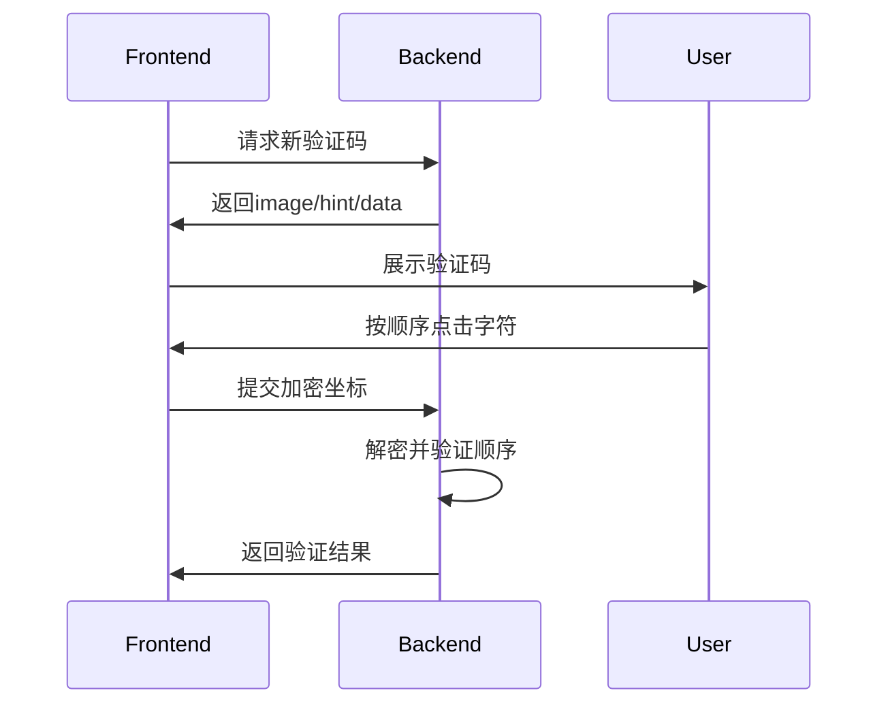

[](https://www.npmjs.com/package/click-captcha)
[](https://github.com/fffmoon/click-captcha)


# ClickCaptcha


javascript 的中文点序验证解决方案 | Chinese Character Sequence Click Verification

专为中文场景设计的抗机器识别验证系统


## 特性亮点

✨ **中文优先** - 专为中文字符验证设计  
🎯 **点序验证** - 必须按正确顺序点击才通过  
🛡 **反 AI 识别** - 动态干扰线+字符扭曲技术  
⚡ **高性能** - 单核可达 3000+ 次/秒生成速度  
🔧 **可定制** - 支持自定义尺寸/字体/颜色/干扰项

## 快速开始

### 安装

npm

```bash
npm install click-captcha
```

yarn

```bash
yarn add click-captcha
```

### 基础使用

```typescript
import { ClickCaptcha } from "click-captcha";
// 初始化实例
const captcha = new ClickCaptcha();

// 生成验证码
const { image, hint, data } = await captcha.generate();
// image 验证码
// hint 提示用户内容
// data 不提供给用户

// 验证用户点击
const positions = [
  { x: 100, y: 50 },
  { x: 200, y: 30 },
]; // 来自前端的点击数据，建议加密
const isValid = captcha.verify(positions, data); // true通过 false不通过
```

## 配置选项

| 参数         | 类型             | 默认值   | 说明               |
| ------------ | ---------------- | -------- | ------------------ |
| `width`      | number           | 400      | 画布宽度           |
| `charCount`  | number           | 4        | 验证字符数量       |
| `noise`      | number           | 3        | 干扰线数量 (0-5)   |
| `fontSize`   | number           | 40       | 字符字号           |
| `expire`     | number           | 180      | 验证码有效期(秒)   |
| **高级配置** |                  |          |                    |
| `fontPath`   | string           | 内置字体 | 字体的 base64 数据 |
| `hintType`   | 'svg' \| 'image' | 'svg'    | 提示信息类型       |

## 安全实践 🔒

服务端存储建议使用 Redis

```typescript
import { createClient } from 'redis';
const redis = createClient();
await redis.setEx(captcha:${captchaId}, 180, JSON.stringify(data));
```

## 最佳实践

1. **不要在前端明文传输点击坐标**
2. **每个验证码仅允许 3 次尝试**
3. **生产环境建议使用自定义字体**
4. **验证通过后立即销毁服务端记录**

## 工作原理


